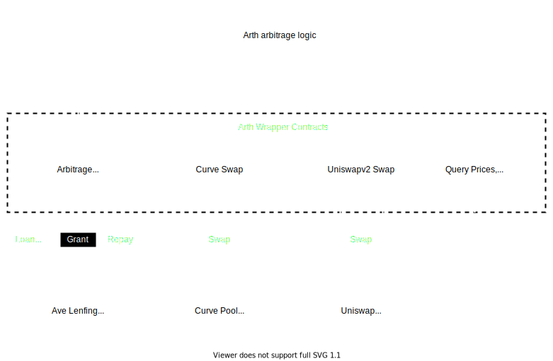

# Flash Loan Arbitrage

## Objectives
* Low gas fee burnt on revert
* Add new DEXs and Flash loan lenders easily

It consists of primitive contracts and pipeline contracts.

## Primitive Contracts
### ArthCurveSwap
Smart contract wrapper for peforming asset swap on Curve pool.
### ArthUniswapv2Swap
Smart contract wrapper for peforming asset swap on UniswapV2 pair.
## Arbitrage Chain Contracts
These contracts gule two or more swap contracts to perform the arbitrage.
### ArthArbitrageA1CU2
Implements logic for obtaining flash loan from Ave and performing asset swaps on Curve and UniswapV2.
It provides interface for specifying asset type, Curve pool and UniswapV2 pair to be used for swapping.
